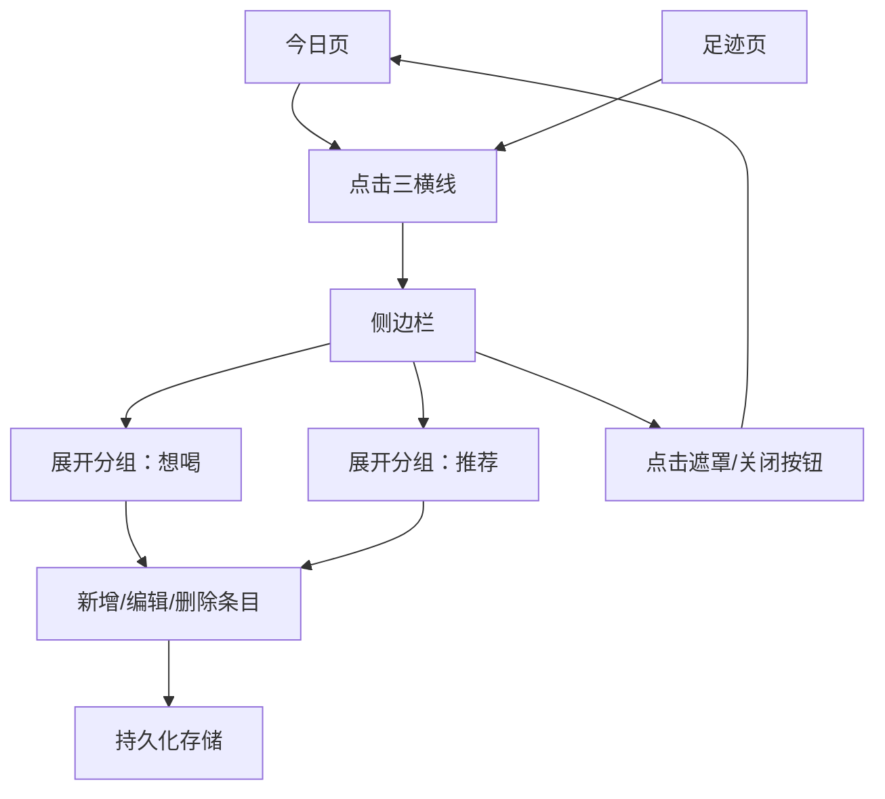

## 1. 产品概述
在应用内新增全局右上角“三横线”入口侧边栏，“今日/足迹”页均可打开。
侧边栏包含头像与两个可收纳分组「想喝」「推荐」，支持条目持久化存储与管理。

## 2. 核心功能

### 2.1 功能模块
本次需求涉及的页面包括：
1. **今日页**：右上角三横线入口、打开/关闭侧边栏。
2. **足迹页**：右上角三横线入口、打开/关闭侧边栏。
3. **侧边栏**：头像展示、分组收纳、条目增删改与存储。

### 2.2 页面详情
| 页面名称 | 模块名称 | 功能描述 |
|---|---|---|
| 今日页 | 顶部入口（三横线） | 在右上角展示三横线按钮；点击打开侧边栏；侧边栏打开时支持点击遮罩或滑动/按钮关闭。 |
| 足迹页 | 顶部入口（三横线） | 在右上角展示三横线按钮；点击打开侧边栏；侧边栏打开时不影响当前页数据展示与滚动。 |
| 侧边栏 | 用户区（头像） | 展示用户头像（无头像时显示默认占位头像/首字母）。 |
| 侧边栏 | 分组收纳（想喝/推荐） | 展示两个可折叠分组「想喝」「推荐」；支持展开/收起；默认记忆上次展开状态（可选）。 |
| 侧边栏 | 条目列表 | 在分组下展示条目列表（至少包含：标题；可选：副标题/备注/缩略图）；条目为空时展示空态文案与新增入口。 |
| 侧边栏 | 条目管理与存储 | 支持在分组内新增条目（输入标题，选填备注/图片链接）；支持删除条目；支持编辑条目（标题/备注/图片链接）；所有变更需持久化存储，刷新/重开后仍保留。 |

## 3. 核心流程

### 3.1 侧边栏访问
1. 你在“今日”或“足迹”页点击右上角三横线。
2. 侧边栏从右侧滑入并覆盖在当前页面之上（带半透明遮罩）。
3. 你点击遮罩或侧边栏内关闭按钮，侧边栏收起。

### 3.2 想喝/推荐条目管理
1. 你在侧边栏中展开「想喝」或「推荐」。
2. 点击“新增条目”，输入标题（必填）与备注/图片链接（可选）并保存。
3. 你可以对已有条目进行编辑或删除。
4. 下次打开侧边栏时，你仍能看到之前保存的条目。

