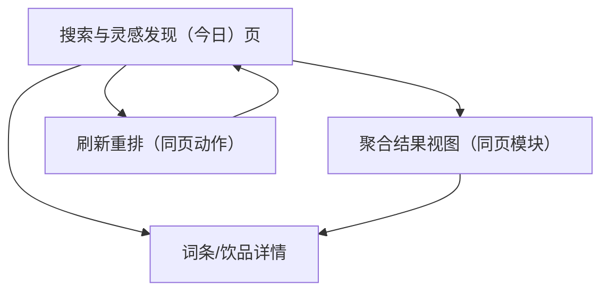

## 1. Product Overview
把“今日”页重构为“搜索与灵感发现”中心：提供全局模糊搜索与可刷新重排的动态漂浮词云，帮助你更快发现想喝/值得尝试的品牌与新品卖点。

## 2. Core Features

### 2.1 Feature Module
本次需求由以下最小可用页面构成：
1. **搜索与灵感发现（今日）页**：全局模糊搜索、动态漂浮词云、词条聚合结果（饮品/品牌/卖点）、刷新重排。
2. **词条/饮品详情页（或右侧抽屉）**：词条信息、关联饮品卡片列表、来源与时间戳。

### 2.3 Page Details
| Page Name | Module Name | Feature description |
|---|---|---|
| 搜索与灵感发现（今日）页 | 顶部全局搜索 | 支持品牌/新品名/卖点关键词的模糊匹配；输入时展示联想建议；回车后展示聚合结果（按“词条/饮品/品牌”分组）。 |
| 搜索与灵感发现（今日）页 | 动态漂浮词云 | 展示“品牌+新品+卖点”词条；按权重体现字号；自动缓慢漂浮避免遮挡；支持点击进入详情；支持悬停高亮与提示（来源/更新时间）。 |
| 搜索与灵感发现（今日）页 | 刷新重排 | 提供“刷新”按钮：重新拉取数据（或使用缓存）并重排词云布局；支持“仅重排布局（不换数据）/换一批（换数据）”两种模式。 |
| 搜索与灵感发现（今日）页 | 结果聚合区 | 当你搜索或点击词云词条时，展示关联饮品卡片与关键卖点；支持排序（热度/最新）；支持一键清空筛选回到词云。 |
| 词条/饮品详情页 | 词条信息 | 展示品牌、新品名（如有）、卖点列表、标签（如：健康/低糖/地域食材）、更新时间戳、数据来源链接。 |
| 词条/饮品详情页 | 关联内容 | 展示相关词条（同品牌/同卖点）与相关饮品卡片；支持从详情继续跳转。 |

## 3. Core Process
- 灵感发现流：你打开“今日”页 → 浏览漂浮词云 → 悬停查看提示 → 点击感兴趣词条 → 进入详情（或右侧抽屉）查看卖点与关联饮品 → 可继续点相关词条扩散探索 → 点击“清空”回到词云。
- 搜索流：你在顶部输入关键词（支持模糊）→ 从联想选择或回车 → 进入聚合结果视图 → 通过筛选/排序缩小范围 → 打开词条/饮品详情。
- 刷新流：你点击“仅重排”→ 词云使用同一批数据重新布局；你点击“换一批”→ 触发后端 web_search 生成新词条 → 前端重排并替换。

