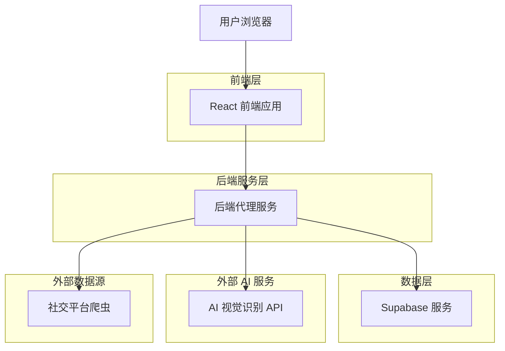
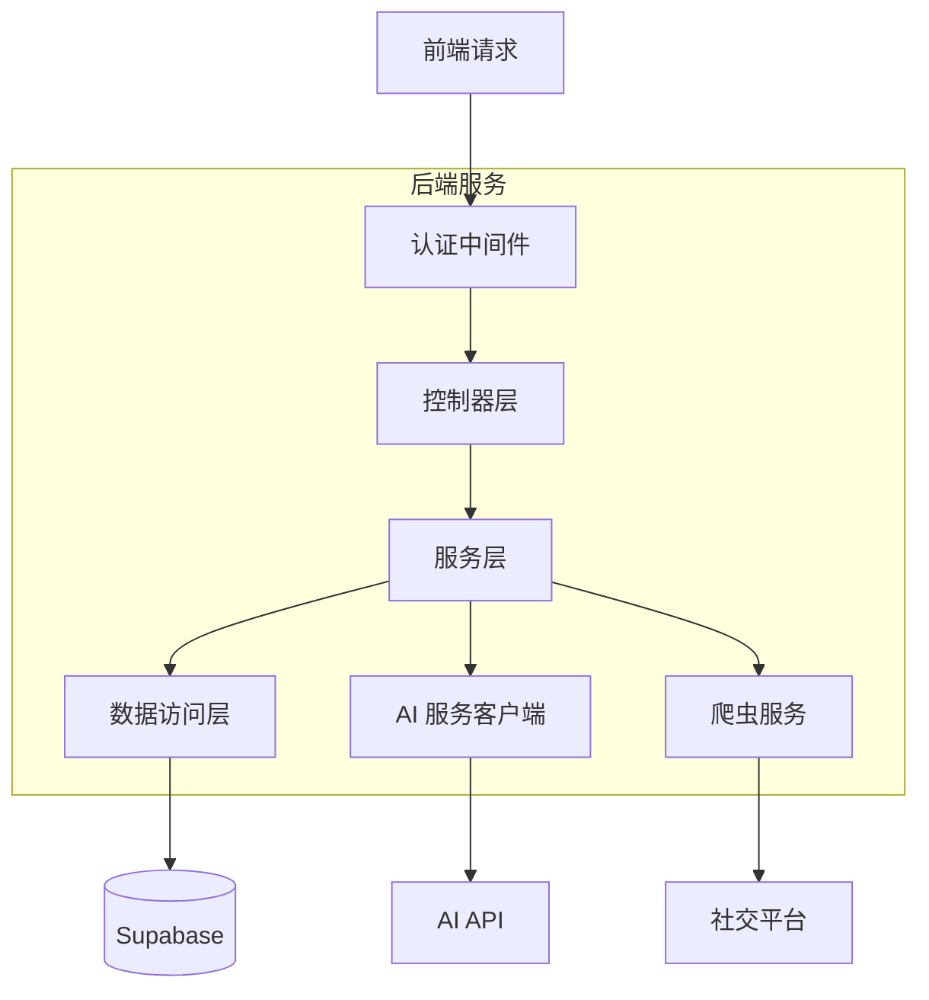
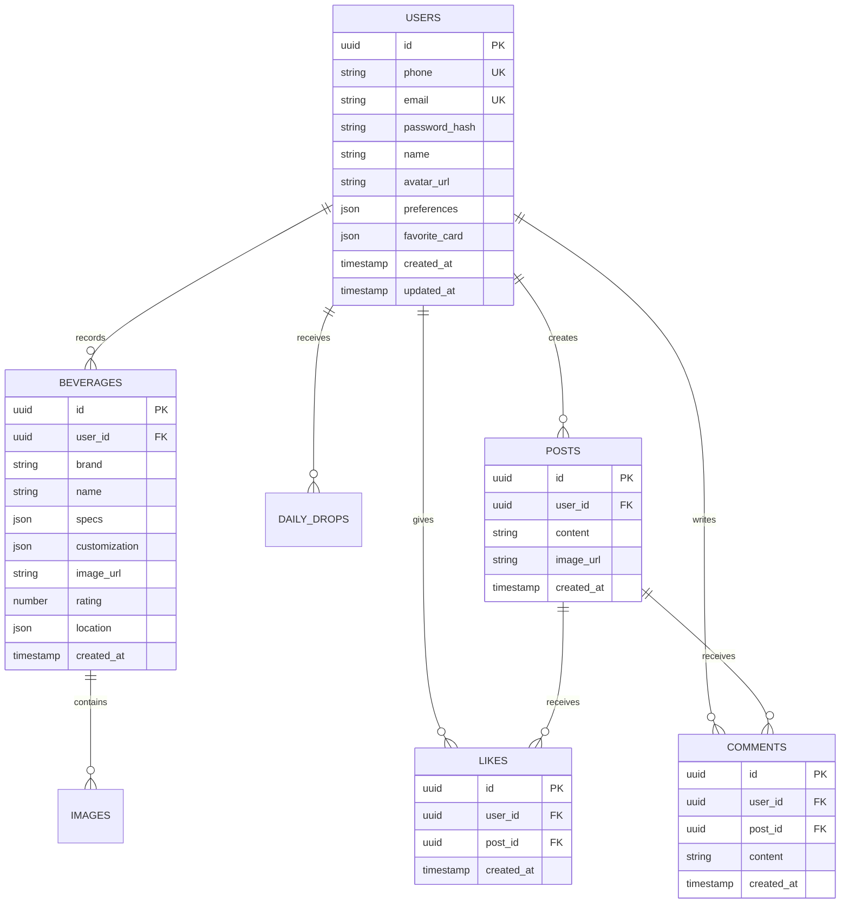

## 1. 架构设计



## 2. 技术栈描述

- **前端**：React@18 + TypeScript + Tailwind CSS + Vite
- **初始化工具**：vite-init
- **后端**：Node.js@18 + Express@4 + TypeScript
- **数据库**：Supabase (PostgreSQL)
- **认证**：Supabase Auth + JWT
- **AI 服务**：GPT-4V API / Claude 3 API（服务端调用）
- **任务调度**：node-cron
- **文件存储**：Supabase Storage

## 3. 路由定义

| 路由 | 用途 |
|------|------|
| / | 首页，展示每日新品和个人饮品 |
| /onboarding | 用户引导页，偏好设置 |
| /community | 社区页面，社交互动 |
| /scanner | 扫描器页面，AI 视觉识茶 |
| /memories | 记忆页面，个人饮品历史 |
| /profile | 个人中心，用户信息和设置 |
| /login | 登录页面 |
| /register | 注册页面 |

## 4. API 定义

### 4.1 认证与引导
```
POST /api/auth/register
POST /api/onboarding/submit
```
`submit` 请求：
| 参数名 | 参数类型 | 描述 |
|--------|----------|------|
| answers | json | 5个问题的答案 |

`submit` 响应：
| 参数名 | 参数类型 | 描述 |
|--------|----------|------|
| recommendation | object | 本命奶茶推荐信息 |

### 4.2 饮品识别
```
POST /api/beverages/scan
```
请求：
| 参数名 | 参数类型 | 是否必需 | 描述 |
|--------|----------|----------|------|
| image | file | true | 饮品照片 |
| location | object | false | 地理位置信息 |

响应：
| 参数名 | 参数类型 | 描述 |
|--------|----------|------|
| brand | string | 品牌名称 |
| name | string | 品名 |
| specs | object | 规格信息（冷热、杯型） |
| customization | object | 定制参数 |
| confidence | number | 识别置信度 |

### 4.3 饮品记录
```
POST /api/beverages
```
请求：
| 参数名 | 参数类型 | 是否必需 | 描述 |
|--------|----------|----------|------|
| brand | string | true | 品牌 |
| name | string | true | 品名 |
| image_url | string | true | 图片地址 |
| specs | object | false | 规格 |
| customization | object | false | 定制参数 |
| rating | number | false | 评分 |

### 4.4 社区互动
```
GET /api/community/feed
POST /api/community/posts
POST /api/community/posts/:id/like
POST /api/community/posts/:id/comment
DELETE /api/community/posts/:id/like
GET /api/community/posts/:id/comments
```

社区API详细定义：

发布动态：
```
POST /api/community/posts
```
请求：
| 参数名 | 参数类型 | 是否必需 | 描述 |
|--------|----------|----------|------|
| content | string | true | 动态文字内容 |
| image_url | string | true | 饮品图片地址 |
| beverage_id | string | false | 关联的饮品记录ID |

点赞/取消点赞：
```
POST /api/community/posts/:id/like
DELETE /api/community/posts/:id/like
```

发表评论：
```
POST /api/community/posts/:id/comment
```
请求：
| 参数名 | 参数类型 | 是否必需 | 描述 |
|--------|----------|----------|------|
| content | string | true | 评论内容 |

### 4.5 每日新品
```
GET /api/daily-drop
```

## 5. 服务端架构



## 6. 数据模型

### 6.1 数据模型定义


### 6.2 数据定义语言

个性化引导相关表 (user_preferences) - 新增
```sql
-- 用户偏好表
CREATE TABLE user_preferences (
    id UUID PRIMARY KEY DEFAULT gen_random_uuid(),
    user_id UUID REFERENCES users(id) ON DELETE CASCADE,
    question_id INTEGER NOT NULL, -- 问题编号1-5
    selected_tags TEXT[] NOT NULL, -- 选择的标签数组
    created_at TIMESTAMP WITH TIME ZONE DEFAULT NOW()
);

-- 最佳匹配推荐表
CREATE TABLE user_recommendations (
    id UUID PRIMARY KEY DEFAULT gen_random_uuid(),
    user_id UUID REFERENCES users(id) ON DELETE CASCADE,
    beverage_name VARCHAR(255) NOT NULL,
    beverage_image_url TEXT,
    reason TEXT, -- 推荐理由
    created_at TIMESTAMP WITH TIME ZONE DEFAULT NOW()
);
```

用户表 (users) - 更新
```sql
CREATE TABLE users (
    id UUID PRIMARY KEY DEFAULT gen_random_uuid(),
    phone VARCHAR(20) UNIQUE,
    email VARCHAR(255) UNIQUE,
    password_hash VARCHAR(255) NOT NULL,
    name VARCHAR(100) NOT NULL,
    avatar_url TEXT,
    preferences JSONB DEFAULT '{}', -- 存储5个问题的答案
    favorite_card JSONB DEFAULT '{}', -- 存储本命奶茶推荐结果
    created_at TIMESTAMP WITH TIME ZONE DEFAULT NOW(),
    updated_at TIMESTAMP WITH TIME ZONE DEFAULT NOW()
);
```

社区相关表 (posts, likes, comments) - 增强
```sql
-- 帖子表 - 增强版
CREATE TABLE posts (
    id UUID PRIMARY KEY DEFAULT gen_random_uuid(),
    user_id UUID REFERENCES users(id) ON DELETE CASCADE,
    content TEXT,
    image_url TEXT NOT NULL,
    beverage_id UUID REFERENCES beverages(id) ON DELETE SET NULL, -- 关联饮品记录
    like_count INTEGER DEFAULT 0,
    comment_count INTEGER DEFAULT 0,
    created_at TIMESTAMP WITH TIME ZONE DEFAULT NOW(),
    updated_at TIMESTAMP WITH TIME ZONE DEFAULT NOW()
);

-- 点赞表
CREATE TABLE likes (
    id UUID PRIMARY KEY DEFAULT gen_random_uuid(),
    user_id UUID REFERENCES users(id) ON DELETE CASCADE,
    post_id UUID REFERENCES posts(id) ON DELETE CASCADE,
    created_at TIMESTAMP WITH TIME ZONE DEFAULT NOW(),
    UNIQUE(user_id, post_id) -- 防止重复点赞
);

-- 评论表 - 增强版
CREATE TABLE comments (
    id UUID PRIMARY KEY DEFAULT gen_random_uuid(),
    user_id UUID REFERENCES users(id) ON DELETE CASCADE,
    post_id UUID REFERENCES posts(id) ON DELETE CASCADE,
    content TEXT NOT NULL,
    parent_comment_id UUID REFERENCES comments(id) ON DELETE CASCADE, -- 支持回复评论
    created_at TIMESTAMP WITH TIME ZONE DEFAULT NOW(),
    updated_at TIMESTAMP WITH TIME ZONE DEFAULT NOW()
);

-- 创建索引优化查询
CREATE INDEX idx_posts_user_id ON posts(user_id);
CREATE INDEX idx_posts_created_at ON posts(created_at DESC);
CREATE INDEX idx_likes_post_id ON likes(post_id);
CREATE INDEX idx_likes_user_id ON likes(user_id);
CREATE INDEX idx_comments_post_id ON comments(post_id);
CREATE INDEX idx_comments_parent_id ON comments(parent_comment_id);
```
