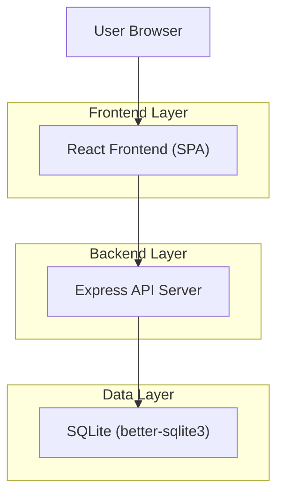
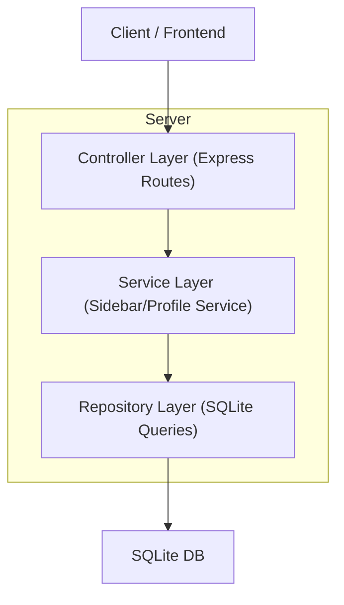
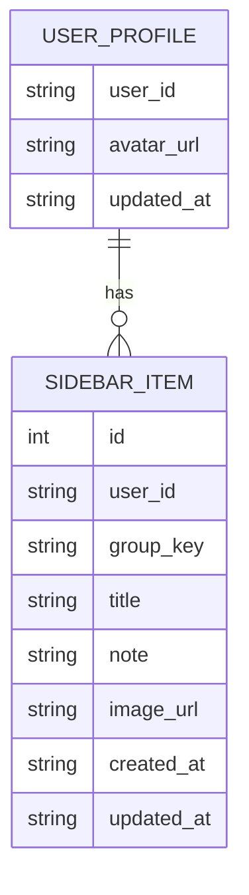

## 1.Architecture design



## 2.Technology Description
- Frontend: React@19 + vite + tailwindcss + lucide-react + motion/react
- Backend: Node.js + Express
- Database: SQLite + better-sqlite3

## 3.Route definitions
| Route | Purpose |
|---|---|
| / | 应用主容器（默认展示“今日”Tab） |
| /?tab=footprint | 切换展示“足迹”Tab（可与现有 Tab 状态并存） |

## 4.API definitions (If it includes backend services)

### 4.1 Core Types (TypeScript)
```ts
export type SidebarGroupKey = 'want' | 'recommend';

export type SidebarItem = {
  id: number;
  user_id: string; // 默认为 "guest" 或未来接入登录后的 userId
  group_key: SidebarGroupKey;
  title: string;
  note?: string;
  image_url?: string;
  created_at: string;
  updated_at: string;
};

export type UserProfile = {
  user_id: string;
  avatar_url: string;
  updated_at: string;
};
```

### 4.2 Sidebar APIs
#### 获取分组条目
`GET /api/sidebar/items?group=want|recommend&userId=guest`

Response: `SidebarItem[]`

#### 新增条目
`POST /api/sidebar/items`

Request:
| Param Name| Param Type | isRequired | Description |
|---|---|---|---|
| userId | string | true | 用户标识（默认 guest） |
| group | 'want'\|'recommend' | true | 分组 |
| title | string | true | 条目标题 |
| note | string | false | 备注 |
| imageUrl | string | false | 图片链接 |

Response: `{ id: number }`

#### 更新条目
`PUT /api/sidebar/items/:id`

Request:
| Param Name| Param Type | isRequired | Description |
|---|---|---|---|
| title | string | false | 标题 |
| note | string | false | 备注 |
| imageUrl | string | false | 图片链接 |

Response: `{ success: boolean }`

#### 删除条目
`DELETE /api/sidebar/items/:id`

Response: `{ success: boolean }`

#### 获取/更新头像（可选，仅满足“侧边栏含头像”）
- `GET /api/profile?userId=guest` -> `UserProfile`
- `PUT /api/profile?userId=guest` body: `{ avatarUrl: string }` -> `{ success: boolean }`

## 5.Server architecture diagram (If it includes backend services)


## 6.Data model(if applicable)

### 6.1 Data model definition


### 6.2 Data Definition Language
User Profile (user_profile)
```
CREATE TABLE IF NOT EXISTS user_profile (
  user_id TEXT PRIMARY KEY,
  avatar_url TEXT DEFAULT '',
  updated_at DATETIME DEFAULT CURRENT_TIMESTAMP
);
```

Sidebar Items (sidebar_items)
```
CREATE TABLE IF NOT EXISTS sidebar_items (
  id INTEGER PRIMARY KEY AUTOINCREMENT,
  user_id TEXT NOT NULL,
  group_key TEXT NOT NULL CHECK (group_key IN ('want','recommend')),
  title TEXT NOT NULL,
  note TEXT DEFAULT '',
  image_url TEXT DEFAULT '',
  created_at DATETIME DEFAULT CURRENT_TIMESTAMP,
  updated_at DATETIME DEFAULT CURRENT_TIMESTAMP
);

CREATE INDEX IF NOT EXISTS idx_sidebar_items_user_group_created
ON sidebar_items(user_id, group_key, created_at DESC);
```