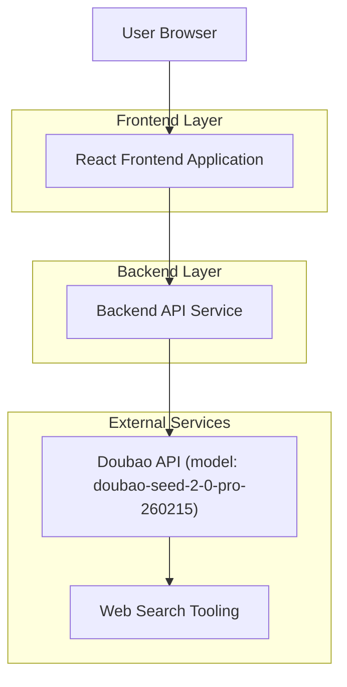

## 1.Architecture design


## 2.Technology Description
- Frontend: React@18 + TypeScript + vite + tailwindcss@3
- Backend: Node.js (Express@4 或同等 serverless 形态)

## 3.Route definitions
| Route | Purpose |
|---|---|
| /today | “搜索与灵感发现（今日）”页：搜索框、词云、聚合结果区 |
| /term/:termId | 词条/饮品详情（可实现为页面或可路由的抽屉态） |

## 4.API definitions (If it includes backend services)
### 4.1 Core API
获取词云词条（可指定重排/换一批）
```
GET /api/inspiration/terms?mode=relayout|refresh&seed?=string
```
Response（核心字段）
```ts
type Term = {
  id: string
  displayText: string // UI展示：品牌 + 新品 + 卖点（摘要）
  brand: string
  product?: string
  sellingPoints: string[]
  weight: number // 词云字号权重
  sourceUrls: string[]
  updatedAt: string // ISO
}

type TermsResponse = {
  terms: Term[]
  cacheHit: boolean
}
```

基于关键词的全局模糊搜索（同源数据：terms + 关联饮品卡）
```
GET /api/search?q=string
```
Response
```ts
type SearchResult = {
  terms: Term[]
  drinks: Array<{ id: string; name: string; brand?: string; highlights: string[] }>
}
```

### 4.2 Doubao 数据生成策略（后端内部）
- 使用 Doubao 模型 `doubao-seed-2-0-pro-260215`，开启 `web_search` 工具能力，围绕“品牌/新品/卖点”生成结构化 JSON（Term[]）。
- 建议后端做 2 层防护：
  1) 结构化校验（必填字段、数组长度、weight 范围）。
  2) 去重与合并（同品牌同新品同卖点相似度合并）。

## 6.Data model(if applicable)
本需求可不引入数据库：
- 词条数据可仅做短 TTL 内存缓存（例如 10-30 分钟）以降低外部调用成本。

### 示例词条数据（来自公开信息抽样，用于种子数据形态展示）
- 喜茶｜超级植物茶｜羽衣纤体瓶：主打植物茶/健康纤体方向 <mcreference link="https://zhuanlan.zhihu.com/p/31775722690" index="1">1</mcreference>
- 喜茶｜牦牛乳酥油茶：可做热饮、作为阶段性新品活动曝光点 <mcreference link="https://m.bendibao.com/show986775.html" index="3">3</mcreference>
- 瑞幸｜生椰拿铁：累计销量突破 12 亿杯；并强调原产地与供应链投入 <mcreference link="https://www.guancha.cn/GongSi/2025_03_17_768742.shtml" index="5">5</mcreference>
- 奈雪的茶｜瘦瘦小绿瓶：羽衣甘蓝等超级食材、0 添加糖、强调营养/颜值 <mcreference link="https://www.foodaily.com/articles/38793" index="3">3</mcreference>
- 奈雪的茶｜尔滨列巴宝藏茶：地域食材叙事与差异化风味组合 <mcreference link="https://m.thepaper.cn/newsDetail_forward_32368047" index="1">1</mcreference>
