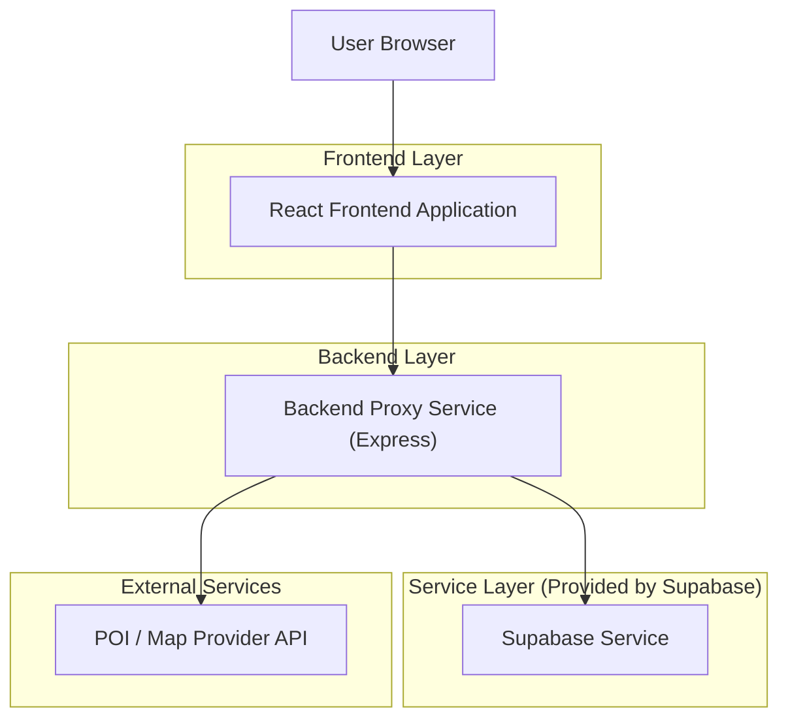
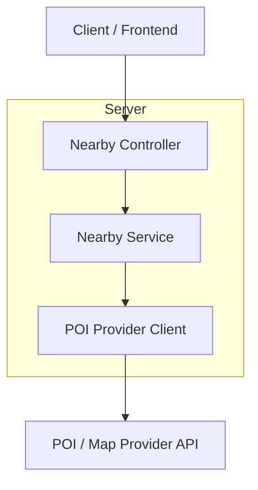

## 1.Architecture design



## 2.Technology Description
- Frontend: React@18 + TypeScript + Tailwind CSS + Vite
- Backend: Node.js@18 + Express@4 + TypeScript
- Auth: Supabase Auth
- Database/Storage: Supabase (PostgreSQL) + Supabase Storage
- External POI: 任选一个地图/POI服务（需要 API Key；Key 仅放在服务端环境变量中，不在前端暴露）

## 3.Route definitions
| Route | Purpose |
|---|---|
| / | 今日页，包含「附近」板块与店铺列表状态展示 |

## 4.API definitions (If it includes backend services)

### 4.1 Core Types (shared)
```ts
type GeoPoint = { lat: number; lng: number };

type NearbyPermissionState = "unknown" | "granted" | "denied" | "unavailable";

type PlaceCategory = "coffee" | "tea" | "drink" | "other";

type NearbyPlace = {
  id: string;
  name: string;
  category: PlaceCategory;
  address: string;
  district?: string;
  distanceMeters?: number; // 仅在精确定位模式返回
  location?: GeoPoint;
  mapUrl?: string; // 直接跳转第三方地图
};
```

### 4.2 Nearby POI
说明：前端只负责调用浏览器定位 API 获取经纬度与处理权限态；后端负责调用第三方POI服务并统一返回结构，避免前端暴露API Key。

#### GET /api/places/nearby
Query:
| Param Name | Param Type | isRequired | Description |
|---|---:|---:|---|
| lat | number | false | 经度（精确定位模式） |
| lng | number | false | 纬度（精确定位模式） |
| radius | number | false | 搜索半径（米），默认 2000 |
| city | string | false | 降级模式：城市/地区文本（如“浦东新区”）；与 lat/lng 二选一 |
| keywords | string | false | 可选：限定“咖啡/奶茶/饮品”等 |

Response:
| Param Name | Param Type | Description |
|---|---|---|
| mode | "precise" \| "city" | 返回模式：精确定位/城市降级 |
| places | NearbyPlace[] | 店铺列表 |

Example response:
```json
{
  "mode": "precise",
  "places": [
    {
      "id": "p_123",
      "name": "XX Coffee",
      "category": "coffee",
      "address": "XX路100号",
      "district": "静安区",
      "distanceMeters": 320,
      "mapUrl": "https://maps.example.com/?q=..."
    }
  ]
}
```

## 5.Server architecture diagram (If it includes backend services)


## 6.Data model(if applicable)
本功能默认不新增数据库表；若需要降低外部POI调用频率，可在服务端增加短期缓存（内存/LRU）作为实现细节，而不引入新数据表。